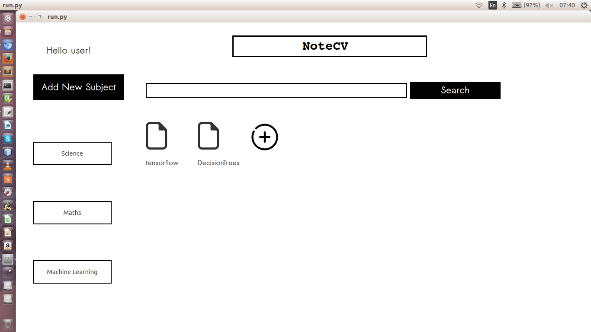
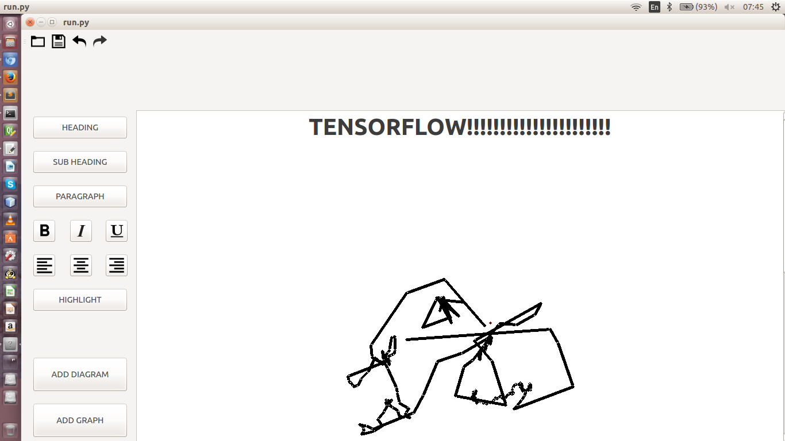

# noteCV
A kind of smart and user-interactive note-making software application.

## Description
noteCV is a smart note taking application made in python to help students all across the globe to take notes easily and effectively. The software is a complete package that enables students to take down and record notes (with interactive interface to make diagrams and graphs). Besides this, it also helps them share notes with each other. 

## Technologies used :
1. python 2.x
2. openCV 2.0
3. PyQt4
4. DesignerQt4
5. mysql database

## HOW-TO
1. Install Python 2.7.X from [here](https://www.python.org/download/releases/)
2. Run python startup.py from the repo's directory to check and install necessary python-modules including cv2 (version 2.X preferred), MySQLdb, PyQt4, numpy.
3. Clone this repository: git clone https://github.com/Arjav96/noteCV.git or click Download ZIP in right panel and extract it.
4. Run python run.py from the repo's directory.
5. Read the OpenCV operating controls instructions.

## Tentative features :
1. Login/Signup window for students
2. List of subjects, student is currently enrolled in.
3. Notebooks (or notes) of each subject arranged topic wise.
4. Infinite long chapters notes possible.
5. Simple and efficient GUI for notes taking.
6. Draw diagrams in open air.
7. Ability to save notebook as pdf.
8. Display of current user online to enable easy share of notes.
9. Peer to peer notes sharing.

## Screenshot :

